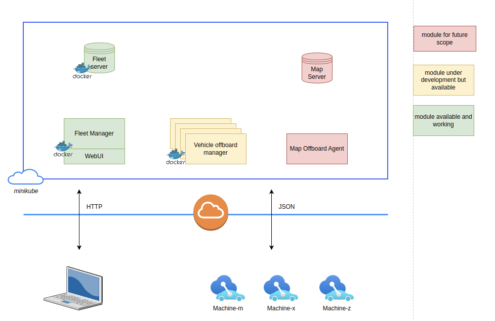

# Fleet-management application

## Assignment details
* *Topic: Build something*
* *Developer: Ashwin Kumar Ganesan*
* _email: asga23@student.bth.se_

# Link to project
Below repository contains the project along with deployment yaml manifests.

[github:fleet-management-repo](https://github.com/ashwin-ch/fleet-management/tree/main)

# Project overview
Fleet management system for machinery vehicles enables operation and maintenance of vehicles deployed in a site.
The vehicle contain a on-board fleet agent, which provides various insights from the vehicle. Provides ability to control, manage and diagnose
vehicle features and faults.
This system also schedules assignment and tracks payload of the vehicle, and its efficiency.

Provides insight on,
- Vehicle identity
- Vehicle accessories
- Vehicle active status
- Interaction between vehicle and offboard agent

Possible expansion for
- Fleet statistics
- Driver productivity
- Site statistics
- Fuel statistics
- Map updates

# Design overview

# Technical specification
The solution is developed based on microservices executing on docker images, there are two microservices running, i.e. fleet-application and vehicle-off-board-manager, along with a fleet-server.

The purpose of fleet-application is to provide interface for site-operators to find the list of vehicles and their statistics on a web-ui. While the vehicle-off-board-manager provides ability for vehicle to connect with the server to push and pull data. This manager has the ability to push goals and target site activities like loading, dumping etc. while also allows vehicle to push notification on service required, driver details, vehicle status. There is a simple node json.server deployed in the background, which is a centralized between both the applications to fetch and update information spontaneously.

## Fleet server
This is a simple vehicle database constructed for this concept based on json-server, which contains different parameters
relevant to the vehicle for providing insights to supervisor through front-end dashboard

## Fleet Application
Fleet application component is developed based on javascript, css and html, to be able to process the information from database and
provide a dashboard view through a web-client for site supervisors. This has possible extension to diagnose individual vehicle, assign tasks
to different machineries.

## Vehicle offboard agent (vehicle manager)
Vehicle manager is a microservice deployed in order to bridge between the off-board and on-board systems. This agent is developed using Flask-python.
This provides REST Calls for vehicle to connect, get information about the vehicle assignment, map data and upload vehicle diagnostics data, fuel statistics, payload statistics and assignment status for autonomous control vehicles. For this prototype, we use CURL commands to connect to the vehicle-agent as experiement, while the on-board device on machine can use RestAPIs to communicate with vehicle-off-board-agent.

# Docker images

## Fleet server
[aganesa2/fleetserver:dev](https://hub.docker.com/repository/docker/aganesa2/fleetserver/general)

## Fleet manager
[aganesa2/fleetserver:dev](https://hub.docker.com/repository/docker/aganesa2/fleetmgr/general)

## Vehicle manager
[aganesa2/vehiclemgr:dev](https://hub.docker.com/repository/docker/aganesa2/vehiclemgr/general)

## Start minikube and ensure pods are running
Start minikube
> $ minikube start

Check running nodes with minikube a part of it
> $ kubectl get nodes

Start a k8 dashboard in a separate terminal
> $ minikube dashboard
_if necessary some addons might be required to be enabled before starting a dashboard_
This opens a dashboard in [127.0.0.1:39507](http://127.0.0.1:39507/api/v1/namespaces/kubernetes-dashboard/services/http:kubernetes-dashboard:/proxy/#/workloads?namespace=default)

## Starting applications using K8s in minikube
To create a pod using locally built image
> $ kubectl apply -f fleet-deployment-v1.yaml

To create services required for deployment
> $ minikube service fleet-service
> $ minikube service fleet-manager-service

To check if the pods are running
> $ kubectl get pods
> $ kubectl get services

To delete a deployment created in K8s
> $ kubectl delete -n default deployment fleet-deployment

The dashboard should be able to provide insights on the deployment, pods, services and logs.