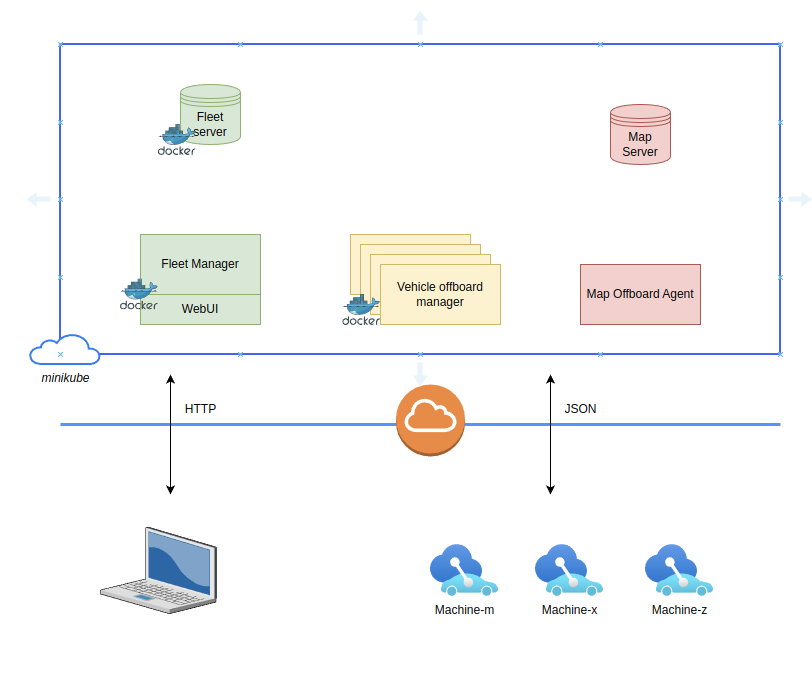

# Project Overview
- Scope - Fleet management offboard application
- Functions/Features
  - Machinery vehicle dashboard
  - Equipment management system

# Design overview

# Tools
  - Node JS _(Vehicle management Frontend dashboard)_
  - Json Server _(vehicle database)_
  - Docker _(Dev and deployment provisioning)_
  - K8s _(Orchestration)_
  - Minikube _(cloud deployment virutualization)_

--------

--------

# Demostration
- Local docker execution
- Kubernetes deployment (_Having difficulties in getting this working_)

--------

# Challenges
+ Network configuration
+ Choosing the right services in K8s deployment
+

# Interesting parts & Learning
+ minikube usage
+ Kubernetes real-time usage and exposure
+ Microservice oriented design
+ Stateless design mechanism

# Future scope
- *Fleet Server*
  - [ ] Migration to MongoDb(_adv. of having each vehicle as a part of collection and scalable approach_)

- *Fleet offboard manager*
  - [ ] User management and login
  - [ ] Vehicle assignment schedule
  - [ ] Vehicle performance dashboard
  - [ ] Vehicle diagnostics

- *Vehicle Offboard Agent*
  - [ ] Autonomous vehicle assignments
  - [ ] Fuel management
  - [ ] Post vehicle errors
  - [ ] Update driver schedules
  - [ ] Driver monitoring

# Q&A
